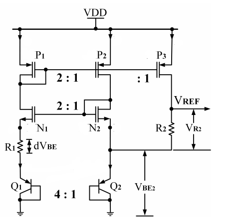
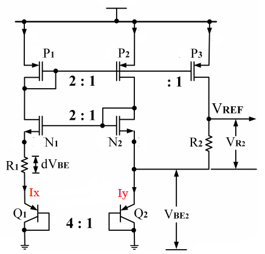
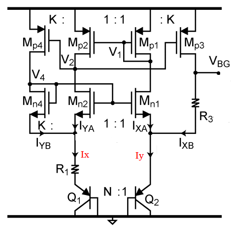

# Efficient-CMOS-Bandgap-Reference-Circuit

**ABSTRACT** -  This work presents efficient bandgap reference(BGR) design using self bias current mirror circuit. This design removes one complementary-to-absolutetemperature (CTAT) bipolar device in voltage reference branch , which reduced the chip area[1]. This design shares the bipolar device used to generate proportional-to-absolute-temperature (PTAT) voltage, thus reducing overall power consumption. Use of self bias current mirror instead of traditionally used operational amplifier also reduces the power requirement, complexity and area of circuit. Different techniques like cascode current mirror [2] and symmetrically matched current mirrors[3] can be used to improve output. Design and simulation of the circuit will be in 28nm CMOS process , for a temperature range of -40°C to 125°C.

# Table of Contents
 * [Introduction](#Introduction)
 * 
 
# Introduction:

In many applications as stable voltage reference is needed  which is independent of power supply and temperature  variations. BGRs are extensively employed as reference  circuits as they have weak dependence on process,  temperature and voltage variations. There are mainly two  types of BGR curcuits:
 1. Using operational amplifier (opamp) 
Use of op-amps have some  disadvantages over current mirrors like 
(a) op—amps require  more power which can be constraint in low power applications. 
(b) require more number of transistors which makes it area inefficient. 
 2. Using current mirror. 
Current mirror based BGRs lacks in  terms of power supply rejection (PSR) as compared to opamp based design but it is simpler to design, requires less power and area with only marginal decrease in performance which makes it an attractive choice for modern applications. 
The PSR of simple current mirror (CM) based BGR can be improved by using cascoded current mirror (CCM) [2] or symetrically matched current mirror (SMCM) [3]

# Proposed Bandgap Reference 
Figure 1(b) shows the core part of the proposed BGR circuit [1] in comparison with traditional circuit 1(a). From the figure it  is clear that proposed circuit uses one bipolar device less in reference branch. The BJT Q2 is used for generation of PTAT voltage across the resistor R1 and voltage across it adds to  VREF. This modification reduces the total current and power consumption of the circuit is reduced by 33% and area required is also reduced.
 

There are further improvements in PSR can be made to the above design using cascode current mirror [2] and symmetrically biasing branches [3] as shown in the figure below.

 
  Fig. 3: Conventional current mirror 
