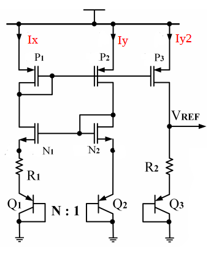

# Efficient-CMOS-Bandgap-Reference-Circuit

**ABSTRACT** -  This work presents efficient bandgap reference(BGR) design using self bias current mirror circuit. This design removes one complementary-to-absolutetemperature (CTAT) bipolar device in voltage reference branch , which reduced the chip area[1]. This design shares the bipolar device used to generate proportional-to-absolute-temperature (PTAT) voltage, thus reducing overall power consumption. Use of self bias current mirror instead of traditionally used operational amplifier also reduces the power requirement, complexity and area of circuit. Different techniques like cascode current mirror [2] and symmetrically matched current mirrors[3] can be used to improve output. Design and simulation of the circuit will be in 28nm CMOS process , for a temperature range of -40°C to 125°C.

# Table of Contents
 * [Introduction](#Introduction)
 * [Proposed Bandgap Reference ](#ProposedBandgapReference)
 * [Tools Used](#toolsused)
*  [Circuit Implementation and Simulations](#CircuitImplementationandSimulations)
* [Summary of Results](#SummaryofResults)
* [Conclusion](#conclusion)
*  [Author](#Author)
*  [Acknowledgements](#Acknowledgements)
* [References](#References)
 
# Introduction:

In many applications as stable voltage reference is needed  which is independent of power supply and temperature  variations. BGRs are extensively employed as reference  circuits as they have weak dependence on process,  temperature and voltage variations. There are mainly two  types of BGR curcuits:
 1. *Using operational amplifier (opamp)* :Use of op-amps have some  disadvantages over current mirrors like op—amps require  more power which can be constraint in low power applications and require more number of transistors which makes it area inefficient. 
2. *Using current mirror* : Current mirror based BGRs lacks in  terms of power supply rejection (PSR) as compared to opamp based design but it is simpler to design, requires less power and area with only marginal decrease in performance which makes it an attractive choice for modern applications. 
The PSR of simple current mirror (CM) based BGR can be improved by using cascoded current mirror (CCM) [2] or symetrically matched current mirror (SMCM) [3]

# Proposed Bandgap Reference:
Fig 2 shows the core part of the proposed BGR circuit [1] in comparison with traditional circuit Fig 1. From the figure it  is clear that proposed circuit uses one bipolar device less in reference branch. The BJT Q2 is used for generation of PTAT voltage across the resistor R1 and voltage across it adds to  VREF. This modification reduces the total current and power consumption of the circuit is reduced by 33% and area required is also reduced by 20%.

<table>
<thead>
  <tr>
    <th> </th>
    <th> </th>
  </tr>
</thead>
<tbody>
  <tr>
    <td>Fig. 1: Conventional BGR Circuit </td>
    <td>Fig. 2: Proposed BGR Circuit </td>
  </tr>
</tbody>
</table>

  

Calculations of R1 and R2 can be done by the formulas given  
below

    R1= Vt ln(4) / I1
    where,	
		Vt = thermal voltage of the semiconductor and its value at room temperature is approximately 25.8 mV
		I1 = bias current of the Q1, Q2 transistors, here i have taken it to be 3uA.

VR2 is the PTAT voltage across the resistor R2 and is given  by the equation below for the proposed architecture

    VR2 = (R2/2R1) . VT . ln(4)

For zero temparature cofficient of the circuit derivative of VREF with respect to temperature must be zero.  

The power-supply rejection (PSR) performance does not change significantly from the traditional selfbiased BGR. The PSR can be improved by using  
(a) cascode current mirrors [2] or  
(b) symmetric biasing of both the branches [3] as shown in the figure below. 

<table>
<thead>
  <tr>
    <th> </th>
  </tr>
</thead>
<tbody>
  <tr>
    <td>Fig. 3: symetrically matched current mirror based BGR circuit </td>
  </tr>
</tbody>
</table>

 
Design and comparison of both of the above improvement methods is also done here.

# Tools Used:

*• Synopsys Custom Compiler:*
&emsp;The Synopsys Custom Compiler™ design environment is a modern solution for full-custom analog, custom digital, and mixed-signal IC design. As the heart of the Synopsys Custom Design Platform, Custom Compiler provides design entry, simulation management and analysis, and custom layout editing features. This tool was used to design the circuit on a transistor level.

*• Synopsys Primewave:*
&emsp;PrimeWave™ Design Environment is a comprehensive and flexible environment for simulation setup and analysis of analog, RF, mixed-signal design, custom-digital and memory designs within the Synopsys Custom Design Platform. This tool helped in various types of simulations of the above designed circuit.

*• Synopsys 28nm PDK:*
&emsp;The Synopsys 28nm Process Design Kit(PDK) was used in creation and simulation of the above designed circuit.

# Circuit Implementation and Simulations 
*Few considerations common to all schematic designs below*
* For all designs PTAT currents **Ix** (labeled in schematics and figures above) were designed to be around **3u A**.
* all mosfets use are of minimum dimensions. Although for real implementation dimensions can be increased to improve matching keeping W/L ratios same. 
*  PNP BJT bipolar devices are used for generation of CTAT currents.
* Ratio of Q1:Q2 is 4:1 for all designs.
* Vcc (supply voltage) = 3.3v 
* Temperature variation form -40 C to 125 C ,  Supply variation from 0v to 5v

## • Case 1: Conventional BGR

<table>
<thead>
  <tr>
    <th> </th>
  </tr>
</thead>
<tbody>
  <tr>
    <td>Fig. 1: Case 1 schematic</td>
  </tr>
</tbody>
</table>

  
 This configuration had maximum current consumption of 12.85u A. Worst line regulation for for a sweep from 2 to 5v of around 640mV/V. 
  
 

<table>
<thead>
  <tr>
    <th> </th>
    <th> </th>
  </tr>
</thead>
<tbody>
  <tr>
    <td>Fig. 5: Temperature Variation</td>
    <td>Fig. 6: Supply Variation</td>
  </tr>
</tbody>
</table>

 

## • Case 2: Propposed BGR

<table>
<thead>
  <tr>
    <th> </th>
  </tr>
</thead>
<tbody>
  <tr>
    <td>Fig. 7: Case 2 schematic</td>
  </tr>
</tbody>
</table>

 
 In this configuration current consumption reduced by around 50% to 6.78u A  and line regulation also improved to around 230mV/V which is a great improvement over conventional design. Also use of smaller resistors in design reduces area covered. 
  

<table>
<thead>
  <tr>
    <th> </th>
    <th> </th>
  </tr>
</thead>
<tbody>
  <tr>
    <td>Fig. 8: Temperature Variation</td>
    <td>Fig. 9: Supply Variation</td>
  </tr>
</tbody>
</table>

 

## • Case 3: Propposed BGR with cascoded current mirror 

<table>
<thead>
  <tr>
    <th> </th>
  </tr>
</thead>
<tbody>
  <tr>
    <td>Fig. 10: Case 3 schematic</td>
  </tr>
</tbody>
</table>

 
From the above schematic, all nmos devices are biased in *subthreshold* region to improve power consumption of the circuit. 
In this case the power consumption is least at only 4.22uA. Line regulation of around 81mV/V which is second best in all cases. Further the used of least valued resistor means that it has least amount of area consumption in all cases  
 

<table>
<thead>
  <tr>
    <th> </th>
    <th> </th>
  </tr>
</thead>
<tbody>
  <tr>
    <td>Fig. 11 : Temperature Variation</td>
    <td>Fig. 12 : Supply Variation</td>
  </tr>
</tbody>
</table>

 

## • Case 4: Propposed BGR with symetrically biased cirrent mirror

<table>
<thead>
  <tr>
    <th> </th>
  </tr>
</thead>
<tbody>
  <tr>
    <td>Fig. 13: Case 4 schematic</td>
  </tr>
</tbody>
</table>

 
From the above schematic, nmos stage is cascoded in addition to symetric bias to improve output. This type of biasing is little complex then previous cases but it achives best PSSR. Above circuit can also be modified to be used in sub 1Vref output voltages, this making attractive option of ultra low power applications. This particular biasing helps in better matching  of mos devices. 
In this case current consumption is slightly increased as compared to previous case at 6.97uA . But this case has best line regulation of around 40mV/V which is best in all cases. 
 

<table>
<thead>
  <tr>
    <th> </th>
    <th> </th>
  </tr>
</thead>
<tbody>
  <tr>
    <td>Fig. 14: Temperature Variation</td>
    <td>Fig. 15: Supply Variation</td>
  </tr>
</tbody>
</table>

 

# Summary of Results

<table>
<thead>
  <tr>
    <th> </th>
    <th> </th>
  </tr>
</thead>
<tbody>
  <tr>
    <td>Fig. 16: Temperature Variation summary </td>
    <td>Fig. 17: Supply Variation summary</td>
  </tr>
</tbody>
</table>

 
 
### Table for summary of key design aspects in above discussed cases
| Case                   | Units | case1 | case2 | case3 | case4 |
|------------------------|-------|-------|-------|-------|-------|
| Supply Current         | uA    | 12.85 | 6.78  | 4.22  | 6.97  |
| Temperature Coffecient |ppm/&deg;C | 14.1  | 4.23  | 41.9  | 4.29  |
| Output Voltage         | V    | 2.11  | 1.43  | 1.17  | 1.58  |
| Line regulation        | mV/V  | 640   | 230   | 81    | 40    |
| Area                   | um^2  | 202   | 170   | 110    | 170    |

# Conclusion

Different ways to improve the efficiency of conventional BGR circuit in terms of total power consumption and area consumption is sucessfully demonstrated. Case 3 circuit performs overall best in terms of area and power but Case 4 circuit is also an attractive option if PSRR at the cost of slight increase in area and power. 

# Author:
-  Piyush Verma, M-tech, Thapar Institute of Engeneering and Technology, Punjab

# Acknowledgements:
• <a href='https://www.iith.ac.in/events/2022/02/15/Cloud-Based-Analog-IC-Design-Hackathon/'>Cloud Based Analog IC Design Hackathon</a> 
• <a href='https://www.synopsys.com/'>Synopsys India</a> 
• <a href='https://www.vlsisystemdesign.com/'>VLSI System Design (VSD) Corp. Pvt. Ltd India</a> 

# References:
[1] Sarangi, Santunu & Tripathy, Dhananjaya & Mahapatra, Subhra & Rout, Saroj. (2020). A Power and Area Efficient CMOS Bandgap Reference Circuit with an Integrated Voltage-Reference Branch. DOI:10.31224/osf.io/4x9g8 
[2] Wu, W., Zhiping, W., and Yongxue, Z. (2007). An Improved CMOS Bandgap Reference with Self-biased Cascoded Current Mirrors. In 2007 IEEE Conference on Electron Devices and Solid-State Circuits, pages 945– 948. DOI: 10.1109/EDSSC.2007.4450282. 
[3] Lam, Y. and Ki, W. (2010). CMOS Bandgap References With SelfBiased Symmetrically Matched Current–Voltage Mirror and Extension of Sub-1-V Design. IEEE Transactions on Very Large Scale Integration (VLSI) Systems, 18(6):857–865, ISSN: 1063-8210, DOI: 10.1109/TVLSI.2009.2016204.

